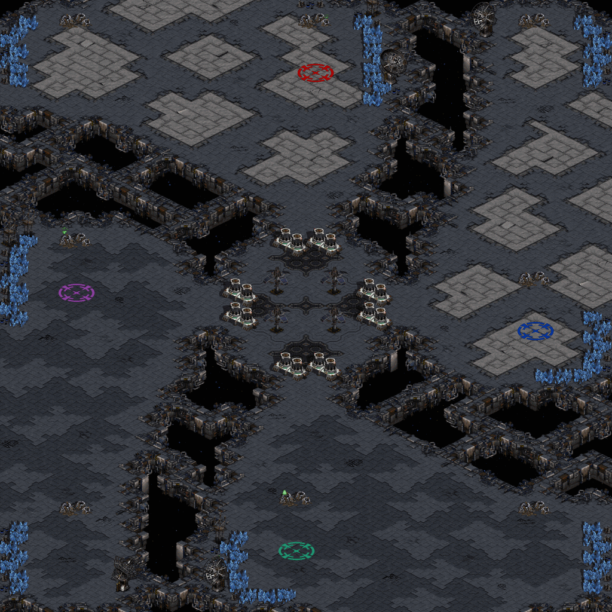
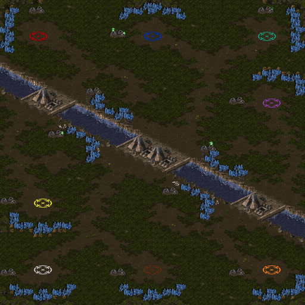
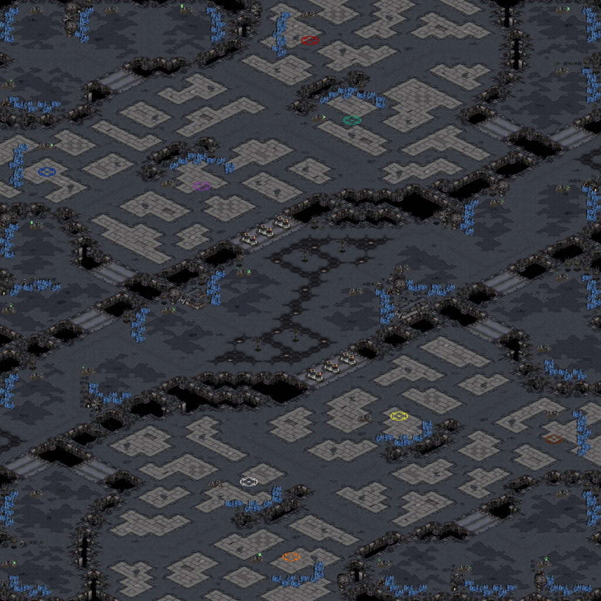

[View on GitHub.io](https://acodcha.github.io/starcraft-maps) · [View on GitHub.com](https://github.com/acodcha/starcraft-maps)

This repository contains my custom-made maps for the StarCraft Remastered video game by Blizzard Entertainment. Maps used in professional leagues are typically designed for 1vs1 games, whereas my maps focus on 2vs2, 3vs3, and 4vs4 team games.

Maps:

- [Intertwined Platforms (2vs2)](#intertwined-platforms-2vs2)
- [Isthmus Scramble (4vs4)](#isthmus-scramble-4vs4)
- [Stratal Concourse (4vs4)](#stratal-concourse-4vs4)

---
---

## Intertwined Platforms (2vs2)

Versus:

- [Intertwined_Platforms_2vs2.scx](https://github.com/acodcha/starcraft-maps/raw/main/maps/Intertwined_Platforms/Intertwined_Platforms_2vs2.scx)
- [Intertwined_Platforms_1vs3.scx](https://github.com/acodcha/starcraft-maps/raw/main/maps/Intertwined_Platforms/Intertwined_Platforms_1vs3.scx)

Cooperative:

- [Intertwined_Platforms_3vs1_Computer.scx](https://github.com/acodcha/starcraft-maps/raw/main/maps/Intertwined_Platforms/Intertwined_Platforms_3vs1_Computer.scx)
- [Intertwined_Platforms_2vs2_Computers.scx](https://github.com/acodcha/starcraft-maps/raw/main/maps/Intertwined_Platforms/Intertwined_Platforms_2vs2_Computers.scx)
- [Intertwined_Platforms_1vs3_Computers.scx](https://github.com/acodcha/starcraft-maps/raw/main/maps/Intertwined_Platforms/Intertwined_Platforms_1vs3_Computers.scx)

[(Back to Top)](#)

---

## Isthmus Scramble (4vs4)

Versus:

- [Isthmus_Scramble_4vs4.scx](https://github.com/acodcha/starcraft-maps/raw/main/maps/Isthmus_Scramble/Isthmus_Scramble_4vs4.scx)

Cooperative:

- [Isthmus_Scramble_4vs1_Computer.scx](https://github.com/acodcha/starcraft-maps/raw/main/maps/Isthmus_Scramble/Isthmus_Scramble_4vs1_Computer.scx)
- [Isthmus_Scramble_4vs2_Computers.scx](https://github.com/acodcha/starcraft-maps/raw/main/maps/Isthmus_Scramble/Isthmus_Scramble_4vs2_Computers.scx)
- [Isthmus_Scramble_4vs3_Computers.scx](https://github.com/acodcha/starcraft-maps/raw/main/maps/Isthmus_Scramble/Isthmus_Scramble_4vs3_Computers.scx)
- [Isthmus_Scramble_4vs4_Computers.scx](https://github.com/acodcha/starcraft-maps/raw/main/maps/Isthmus_Scramble/Isthmus_Scramble_4vs4_Computers.scx)

[(Back to Top)](#)

---

## Stratal Concourse (4vs4)

Versus:

- [Stratal_Concourse_4vs4.scx](https://github.com/acodcha/starcraft-maps/raw/main/maps/Stratal_Concourse/Stratal_Concourse_4vs4.scx)

Cooperative:

- [Stratal_Concourse_4vs1_Computer.scx](https://github.com/acodcha/starcraft-maps/raw/main/maps/Stratal_Concourse/Stratal_Concourse_4vs1_Computer.scx)
- [Stratal_Concourse_4vs2_Computers.scx](https://github.com/acodcha/starcraft-maps/raw/main/maps/Stratal_Concourse/Stratal_Concourse_4vs2_Computers.scx)
- [Stratal_Concourse_4vs3_Computers.scx](https://github.com/acodcha/starcraft-maps/raw/main/maps/Stratal_Concourse/Stratal_Concourse_4vs3_Computers.scx)
- [Stratal_Concourse_4vs4_Computers.scx](https://github.com/acodcha/starcraft-maps/raw/main/maps/Stratal_Concourse/Stratal_Concourse_4vs4_Computers.scx)

[(Back to Top)](#)

---

## License

This work is maintained by Alexandre Coderre-Chabot (<https://github.com/acodcha>) and licensed under the Creative Commons Attribution 4.0 International license. For more details, see the [LICENSE](https://github.com/acodcha/starcraft-maps/blob/main/LICENSE) file or <https://creativecommons.org/licenses/by/4.0>. This work is based on the StarCraft Remastered video game by Blizzard Entertainment. The contents, copyrights, and trademarks of everything involving StarCraft Remastered are exclusively held by Blizzard Entertainment; I make no claim to any of these in any way. All maps are made using either StarCraft Remastered's native StarEdit map editor or the ScmDraft 2 map editor by Stormcoast Fortress (<http://www.stormcoast-fortress.net/cntt/software/scmdraft>).

[(Back to Top)](#)
